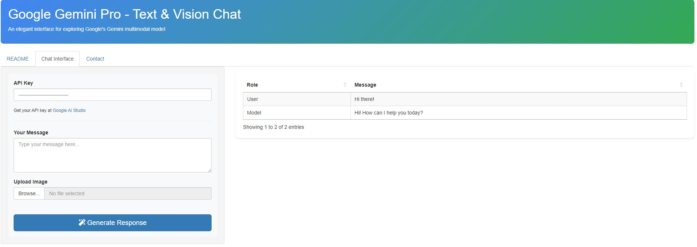
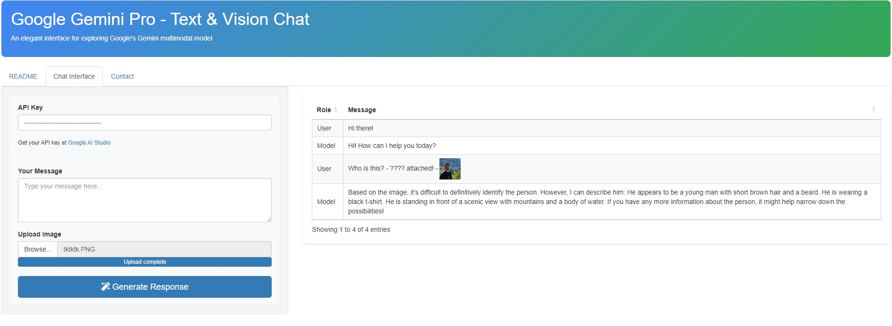

# ShinyGeminiPro - Google GeminiPro Chat App

Welcome to ShinyGeminiPro, an interactive Shiny app that allows you to explore the capabilities of Google's Gemini multimodal conversational model in an open-source R-based environment.

### 🚀 Features

1. 💬 Text Input: Enter user prompts and queries in the "User Input" text area.
2. 📷 Image Upload: Optionally, upload images along with text for a multimodal conversational experience.
3. 🤖 Response Generation: Utilize the Gemini API to generate responses based on the provided user input and images.
4. 📜 Chat History: View the conversation history between the user and the Gemini model in a tabular format.

# Interface

* Google GeminiPro Text Model Results

* Google GeminiPro Vision Model

# Try it on shinyapps.io 🚀
[shinygeminipro / shinyapps.io](https://tolgakurtuluss.shinyapps.io/shinygeminipro/)
